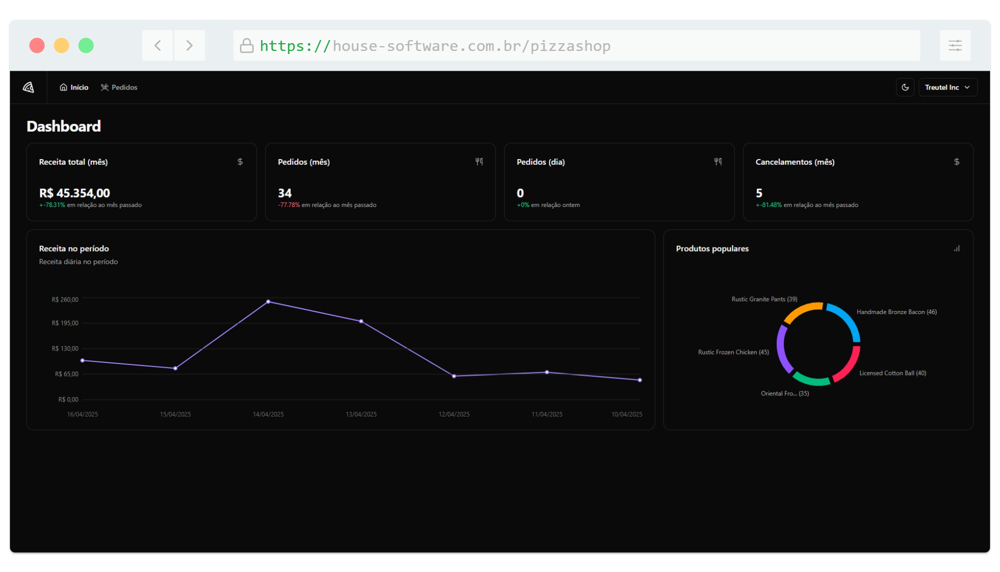
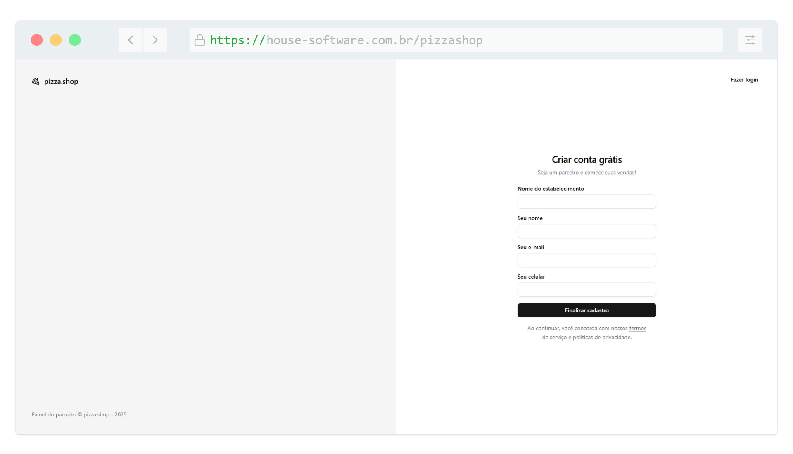
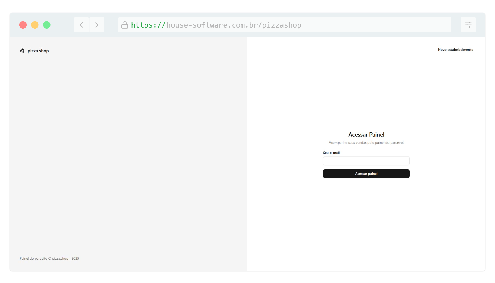
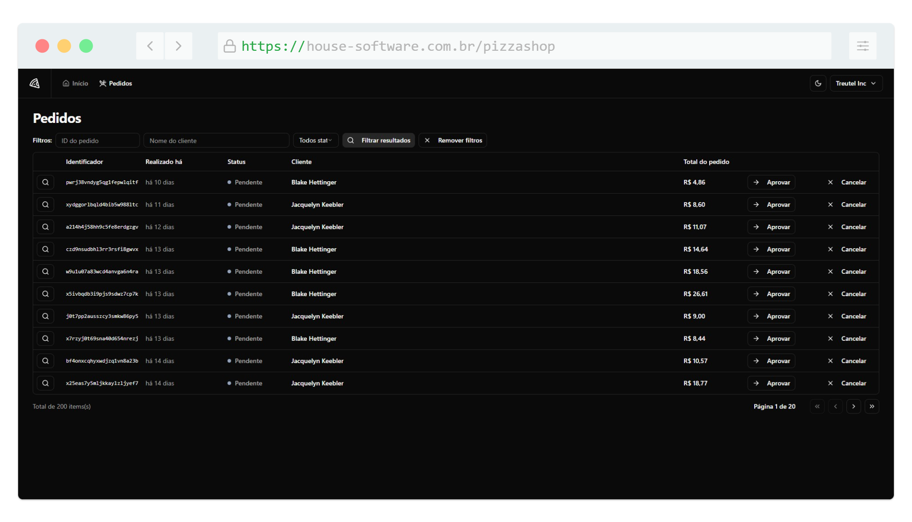
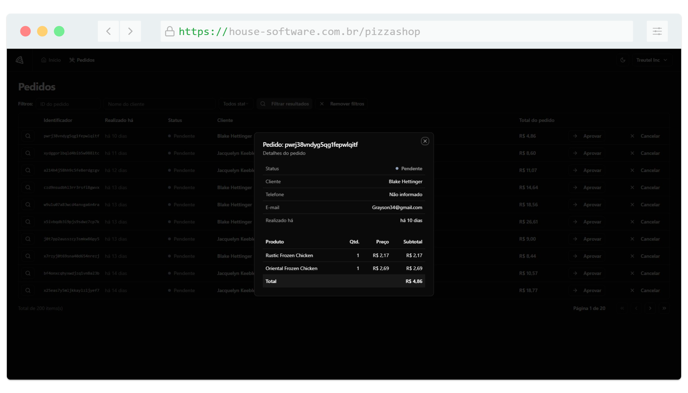

<h1 align="center">
   
</h1>

<h4 align="center"> 
	🚧 Pizzashop Web 🚀 Concluido... 🚀
</h4>

## ✅ Funções

- <h3>Pizzaria</h3>

  - [x] Pesquisar pedidos
  - [x] Listar Métricas
  - [x] Cadastrar
  - [x] Logar

## 📚 Descrição

🚀 New project added to my portfolio!

I’ve built a complete system using React.js and the powerful shadcn/ui component library, focusing on performance and user experience.

The backend was developed with Bun, and the application includes:

✅ Authentication: Login and registration

 📦 Order Management:

 • Paginated and filtered order listing

 • Detailed order view

 📊 Smart Dashboard with real-time metrics:

 • Total revenue (monthly)

 • Orders (monthly)

 • Orders (daily)

 • Cancellations (monthly)

 • Revenue by custom date range

 • Daily revenue chart

 • Most popular products

This project was a great opportunity to explore modern integrations between frontend and backend, implement UI/UX best practices, and display data clearly and effectively.

🔧 Stack: React.js + shadcn/ui + Bun + REST API + Tailwind CSS
Want to check out the project or chat about how I built it? Feel free to message me or drop a comment below! 👇

hashtag#ReactJS hashtag#shadcnUI hashtag#Bun hashtag#DevPortfolio hashtag#Frontend hashtag#Backend hashtag#Fullstack hashtag#TailwindCSS hashtag#APIs hashtag#Dashboard hashtag#HenrickDev

## 🛠 Tecnologias

As seguintes ferramentas foram usadas na construção do projeto:
          
- [Vue.js (v5.0.8)](https://vuejs.org/)
- [Node.js (v20.11.0)](https://nodejs.org/en)
- [NPM (v10.2.4)](https://www.npmjs.com/)
- [HTML5](https://www.w3schools.com/html/default.asp)
-  [CSS 3](https://www.w3schools.com/css/)
-  [JavaScript](https://developer.mozilla.org/pt-BR/docs/Web/JavaScript)

## 📱 Plataforma adotada

- Web;

## 📸 Screenshot

	
	
	
	

